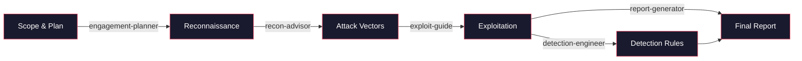
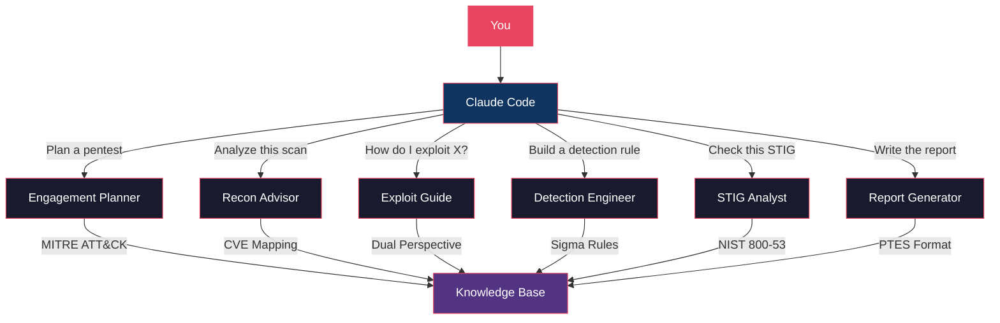

<div align="center">

# pentest-ai

**Turn Claude Code into your offensive security research assistant.**

6 specialized AI subagents for every phase of authorized penetration testing — from scoping to reporting.

[](LICENSE)
[](#agents)
[](https://docs.anthropic.com/en/docs/claude-code)
[](https://attack.mitre.org/)
[](https://github.com/0xSteph/pentest-ai/stargazers)
[](https://github.com/0xSteph/pentest-ai/network/members)
[](https://github.com/0xSteph/pentest-ai/commits/main)
[](https://github.com/0xSteph/pentest-ai/issues)

[Getting Started](#quick-start) | [Agents](#agents) | [Examples](#examples) | [Documentation](#documentation) | [Landing Page](https://0xsteph.github.io/pentest-ai/)

</div>

---

## Table of Contents

- [What Is This?](#what-is-this)
- [Agents](#agents)
- [Workflow](#workflow)
- [pentest-ai vs. Manual Research](#pentest-ai-vs-manual-research)
- [Quick Start](#quick-start)
- [How Agent Routing Works](#how-agent-routing-works)
- [Examples](#examples)
- [Prerequisites](#prerequisites)
- [Documentation](#documentation)
- [Contributing](#contributing)
- [Legal](#legal)
- [License](#license)

---

## What Is This?

pentest-ai is a collection of Claude Code subagents — specialized AI assistants that activate automatically based on what you're working on. Ask Claude to plan a pentest, and the engagement planner agent takes over. Paste Nmap output, and the recon advisor analyzes it. Each agent carries deep domain knowledge in offensive security methodology, MITRE ATT&CK mappings, and industry-standard frameworks.

You don't need to be an expert to use these agents. They communicate at whatever level you need — from explaining what Kerberoasting is to providing exact Impacket command syntax for a senior operator.

### How It Works

1. **Install** the agent files into your Claude Code agents directory
2. **Open Claude Code** and describe your task naturally
3. **Claude automatically routes** to the right specialist agent

No configuration, no commands to memorize. Just describe what you need.

---

## Agents

| Agent | What It Does | Example Prompt |
|-------|-------------|----------------|
| **Engagement Planner** | Plans penetration tests with phased methodology, MITRE ATT&CK technique mapping, time estimates, and rules of engagement templates | *"Plan an internal network pentest for a 500-endpoint Active Directory environment with a 2-week window"* |
| **Recon Advisor** | Parses output from Nmap, Nessus, BloodHound, and 20+ tools. Prioritizes targets, maps CVEs, and recommends specific next commands | *"Analyze this Nmap scan and tell me what to hit first"* |
| **Exploit Guide** | Detailed exploitation methodology covering AD attacks, web apps, cloud, and post-exploitation. Every technique includes the defensive perspective | *"Walk me through AS-REP Roasting — how to execute it and how defenders detect it"* |
| **Detection Engineer** | Produces deployment-ready detection rules in Sigma, Splunk SPL, Elastic KQL, and Sentinel KQL with false positive tuning guidance | *"Create a detection rule for DCSync with Sigma and Splunk SPL"* |
| **STIG Analyst** | DISA STIG compliance analysis with GPO remediation paths, risk scores, verification commands, and keep-open justification templates | *"Analyze V-220768 — what breaks if I apply it, and write a keep-open justification"* |
| **Report Generator** | Transforms raw findings into professional pentest reports with executive summaries, CVSS scoring, evidence formatting, and remediation roadmaps | *"Compile these 12 findings into a professional report with an executive summary"* |

### Agent Capabilities at a Glance

```
engagement-planner ── PTES, OWASP, NIST 800-115, MITRE ATT&CK
                      Rules of engagement templates
                      Phased methodology with time estimates

recon-advisor ─────── Nmap, Nessus, BloodHound, masscan, Shodan + 20 more
                      CVE mapping and attack surface prioritization
                      Specific follow-up commands for each finding

exploit-guide ─────── Active Directory (Kerberoasting, DCSync, delegation attacks)
                      Web apps (OWASP Top 10, API security, deserialization)
                      Cloud (AWS, Azure, GCP privilege escalation)
                      MANDATORY defensive perspective for every technique

detection-engineer ── Sigma, Splunk SPL, Elastic KQL, Sentinel KQL, YARA
                      False positive analysis and tuning guidance
                      Threat hunting hypotheses and queries

stig-analyst ──────── Windows, Linux, AD, Network, VMware, Application STIGs
                      GPO remediation with exact registry paths
                      Keep-open justification templates for auditors

report-generator ──── PTES/OWASP/SANS report format
                      Executive summaries for non-technical leadership
                      CVSS v3.1 scoring and CWE mapping
                      Remediation roadmaps with priority timelines
```

---

## Workflow

Chain agents together for a complete engagement workflow:



### Architecture



---

## pentest-ai vs. Manual Research

| Task | Without pentest-ai | With pentest-ai |
|------|-------------------|-----------------|
| **Plan an engagement** | Hours reviewing PTES/NIST docs, building spreadsheets manually | Structured plan with MITRE mappings in minutes |
| **Analyze Nmap output** | Manually grep through results, cross-reference CVEs one by one | Prioritized attack vectors with specific follow-up commands |
| **Research an AD attack** | Read 10+ blog posts, piece together methodology from multiple sources | Complete methodology with exact commands, OPSEC notes, and detection perspective |
| **Write detection rules** | Translate ATT&CK techniques into Sigma/SPL manually, test for false positives | Deployment-ready rules in multiple formats with tuning guidance |
| **STIG compliance** | Search DISA PDFs, manually map controls, write justifications from scratch | Full analysis with GPO paths, verification commands, and keep-open templates |
| **Write the report** | Days formatting findings, writing executive summaries, calculating CVSS | Professional report structure with consistent formatting in minutes |

---

## Quick Start

```bash
# Clone the repository
git clone https://github.com/0xSteph/pentest-ai.git

# Install globally (available in all projects)
cp pentest-ai/agents/*.md ~/.claude/agents/

# Or install for a specific project
mkdir -p .claude/agents/
cp pentest-ai/agents/*.md .claude/agents/
```

Then open Claude Code and try:

```
"I need to plan an internal penetration test for a mid-size company
with Active Directory, 3 VLANs, and about 500 endpoints.
The engagement window is 2 weeks."
```

Claude automatically routes to the engagement planner agent and produces a full phased plan.

See [INSTALL.md](INSTALL.md) for detailed installation instructions and troubleshooting.

---

## How Agent Routing Works

Claude Code reads the `description` field in each agent's YAML frontmatter to decide when to delegate. You don't need to specify which agent to use — just describe your task naturally.

```yaml
---
name: recon-advisor
description: Delegates to this agent when the user pastes scan output
             (Nmap, Nessus, Nikto, masscan, etc.)...
tools: [Read, Write, Edit, Grep, Glob]
model: sonnet
---
```

Claude matches your intent to the agent description and routes automatically. You can also invoke agents explicitly if you prefer direct control.

---

## Examples

See real agent output in the [examples/](examples/) directory:

| Example | Agent | What It Shows |
|---------|-------|---------------|
| [Engagement Plan](examples/example-engagement-plan.md) | engagement-planner | Full phased plan for an internal network pentest with MITRE ATT&CK mappings |
| [Nmap Analysis](examples/example-nmap-analysis.md) | recon-advisor | Scan analysis with prioritized attack vectors and follow-up commands |
| [Detection Rule](examples/example-detection-rule.md) | detection-engineer | Kerberoasting detection in Sigma, Splunk SPL, and Elastic KQL |
| [STIG Finding](examples/example-stig-finding.md) | stig-analyst | V-220768 analysis with GPO path, verification, and keep-open template |
| [Report Excerpt](examples/example-report-excerpt.md) | report-generator | SQL injection finding formatted for a professional pentest report |

---

## Prerequisites

- [Claude Code](https://docs.anthropic.com/en/docs/claude-code) installed and configured
- Claude Pro or Max subscription
- For authorized security testing: signed rules of engagement and defined scope
- Recommended certifications: OSCP, GPEN, PenTest+, CEH, CPTS (or equivalent experience)

---

## Documentation

| Document | Description |
|----------|-------------|
| [INSTALL.md](INSTALL.md) | Step-by-step installation guide with 3 methods and troubleshooting |
| [Agent Guide](docs/AGENT-GUIDE.md) | How each agent works, when to use it, and example prompts |
| [Customization](docs/CUSTOMIZATION.md) | Modify agents, change models, add tools, create new agents |
| [Contributing](docs/CONTRIBUTING.md) | How to submit improvements and agent quality standards |
| [Disclaimer](DISCLAIMER.md) | Legal and ethical use terms |

---

## Contributing

Contributions welcome. See [docs/CONTRIBUTING.md](docs/CONTRIBUTING.md) for guidelines.

Agent submissions must include MITRE ATT&CK mappings and consider both offensive and defensive perspectives.

---

## Legal

This toolkit is for **authorized security testing only**. Users must have proper written authorization before using these agents in any engagement. See [DISCLAIMER.md](DISCLAIMER.md) for full terms.

These agents provide methodology guidance and analysis. They do not execute attacks, access systems, or generate functional exploit code.

---

## License

[MIT License](LICENSE)

---

<div align="center">

Built by [0xSteph](https://github.com/0xSteph)

If this project helps your security work, consider giving it a star.

</div>
