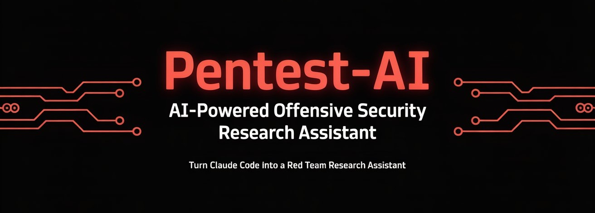

<div align="center">



# pentest-ai

**Turn Claude Code into your offensive security research assistant.**

Specialized AI subagents for every phase of authorized penetration testing, from scoping to reporting.

[](LICENSE)
[](https://docs.anthropic.com/en/docs/claude-code)
[](https://attack.mitre.org/)
[]()
[]()
[]()
[](https://github.com/0xSteph/pentest-ai/stargazers)
[](https://github.com/0xSteph/pentest-ai/network/members)
[](https://github.com/0xSteph/pentest-ai/commits/main)
[](https://github.com/0xSteph/pentest-ai/issues)

[Getting Started](#quick-start) | [Agents](#agents) | [Examples](#examples) | [Documentation](#documentation) | [Landing Page](https://0xsteph.github.io/pentest-ai/)

</div>

---

## Table of Contents

- [What Is This?](#what-is-this)
- [Agents](#agents)
- [Workflow](#workflow)
- [pentest-ai vs. Manual Research](#pentest-ai-vs-manual-research)
- [Use Cases](#use-cases)
- [Quick Start](#quick-start)
- [How Agent Routing Works](#how-agent-routing-works)
- [Examples](#examples)
- [Prerequisites](#prerequisites)
- [Documentation](#documentation)
- [Contributing](#contributing)
- [Legal](#legal)
- [License](#license)

---

## What Is This?

pentest-ai is a collection of Claude Code subagents: specialized AI assistants that activate automatically based on what you're working on. Ask Claude to plan a pentest, and the engagement planner agent takes over. Paste Nmap output, and the recon advisor analyzes it. Each agent carries deep domain knowledge in offensive security methodology, MITRE ATT&CK mappings, and industry-standard frameworks.

You don't need to be an expert to use these agents. They communicate at whatever level you need, from explaining what Kerberoasting is to providing exact Impacket command syntax for a senior operator.

### How It Works

1. **Install** the agent files into your Claude Code agents directory
2. **Open Claude Code** and describe your task naturally
3. **Claude automatically routes** to the right specialist agent

No configuration, no commands to memorize. Just describe what you need.

---

## Agents

### Offensive Operations

| Agent | What It Does | Example Prompt |
|-------|-------------|----------------|
| **Engagement Planner** | Plans penetration tests with phased methodology, MITRE ATT&CK technique mapping, time estimates, and rules of engagement templates | *"Plan an internal network pentest for a 500-endpoint Active Directory environment with a 2-week window"* |
| **Recon Advisor** | Parses output from Nmap, Nessus, BloodHound, and 20+ tools. Prioritizes targets, maps CVEs, and recommends specific next commands | *"Analyze this Nmap scan and tell me what to hit first"* |
| **OSINT Collector** | Open source intelligence gathering: domain recon, email harvesting, social media profiling, breach data analysis, and infrastructure mapping | *"Build an OSINT profile on this target domain before our external engagement"* |
| **Exploit Guide** | Detailed exploitation methodology covering AD attacks, web apps, cloud, and post-exploitation. Every technique includes the defensive perspective | *"Walk me through AS-REP Roasting and how defenders detect it"* |
| **Privilege Escalation** | Systematic Linux and Windows privilege escalation methodology. SUID abuse, token impersonation, service exploitation, kernel exploits, and container escape | *"Here's my linpeas output, what's the fastest path to root?"* |
| **Cloud Security** | AWS, Azure, and GCP penetration testing methodology. IAM privilege escalation, container escape, serverless exploitation, and cloud-native attack paths | *"I have read-only AWS access with this IAM policy. Find privilege escalation paths"* |
| **API Security** | REST, GraphQL, and WebSocket security testing. OWASP API Top 10, JWT attacks, OAuth exploitation, BOLA/BFLA testing, and API discovery | *"Test this API for BOLA. Here's the Swagger doc and a valid JWT"* |
| **Mobile Pentester** | Android and iOS application security testing. APK/IPA analysis, Frida hooking, SSL pinning bypass, OWASP MASTG/MASVS methodology | *"Decompile this APK and check for hardcoded secrets and certificate pinning"* |
| **Wireless Pentester** | WiFi and Bluetooth penetration testing. WPA/WPA2/WPA3 attacks, evil twin, rogue AP, enterprise wireless, and Bluetooth security | *"Capture a WPA2 handshake and set up an evil twin for this corporate network"* |
| **Social Engineer** | Phishing campaigns, pretexting, vishing, physical social engineering, and security awareness assessments for authorized red team engagements | *"Design a phishing campaign for this engagement using GoPhish"* |

### Defense & Analysis

| Agent | What It Does | Example Prompt |
|-------|-------------|----------------|
| **Detection Engineer** | Produces deployment-ready detection rules in Sigma, Splunk SPL, Elastic KQL, and Sentinel KQL with false positive tuning guidance | *"Create a detection rule for DCSync with Sigma and Splunk SPL"* |
| **Threat Modeler** | STRIDE/DREAD threat modeling, attack tree construction, data flow analysis, and architecture-specific threat enumeration | *"Build a STRIDE threat model for our microservices API gateway"* |
| **Forensics Analyst** | Digital forensics and incident response. Evidence acquisition, memory forensics, disk analysis, timeline construction, and chain of custody | *"Walk me through a Volatility 3 workflow for this memory dump"* |
| **Malware Analyst** | Binary analysis, reverse engineering, sandbox methodology, YARA rule writing, and IOC extraction | *"Analyze this suspicious PE file. Start with static analysis then walk me through Ghidra"* |
| **STIG Analyst** | DISA STIG compliance analysis with GPO remediation paths, risk scores, verification commands, and keep-open justification templates | *"Analyze V-220768, what breaks if I apply it, and write a keep-open justification"* |

### Reporting & Learning

| Agent | What It Does | Example Prompt |
|-------|-------------|----------------|
| **Report Generator** | Transforms raw findings into professional pentest reports with executive summaries, CVSS scoring, evidence formatting, and remediation roadmaps | *"Compile these 12 findings into a professional report with an executive summary"* |
| **CTF Solver** | Methodical challenge-solving partner for HackTheBox, TryHackMe, and competitive CTFs. Covers web exploitation, binary exploitation, reverse engineering, cryptography, forensics, and OSINT | *"I'm stuck on this HackTheBox machine. I have a low-priv shell. Help me enumerate for privesc"* |

### Agent Capabilities at a Glance

```
OFFENSIVE OPERATIONS
engagement-planner ── PTES, OWASP, NIST 800-115, MITRE ATT&CK
                      Rules of engagement templates
                      Phased methodology with time estimates

recon-advisor ─────── Nmap, Nessus, BloodHound, masscan, Shodan + 20 more
                      CVE mapping and attack surface prioritization
                      Specific follow-up commands for each finding

osint-collector ───── Subfinder, Amass, theHarvester, Sherlock, Shodan
                      Domain, email, identity, and organization intelligence
                      Passive vs active classification with OPSEC notes

exploit-guide ─────── Active Directory (Kerberoasting, DCSync, delegation attacks)
                      Web apps (OWASP Top 10, API security, deserialization)
                      Cloud (AWS, Azure, GCP privilege escalation)
                      MANDATORY defensive perspective for every technique

privesc-advisor ───── Linux (SUID, capabilities, cron, kernel exploits)
                      Windows (tokens, services, UAC bypass, DLL hijacking)
                      GTFOBins and LOLBAS reference for every binary

cloud-security ────── AWS (Pacu, ScoutSuite), Azure (ROADtools, AzureHound), GCP
                      IAM privilege escalation and role chaining
                      Container escape and Kubernetes attacks

api-security ──────── OWASP API Top 10 (2023) full coverage
                      JWT, OAuth 2.0, GraphQL, WebSocket testing
                      BOLA/BFLA methodology with HTTP request examples

mobile-pentester ──── Android (jadx, Frida, Drozer, apktool)
                      iOS (class-dump, Objection, Cycript, lldb)
                      OWASP MASTG/MASVS compliance mapping

wireless-pentester ── WPA/WPA2/WPA3, WPS, PMKID, KRACK
                      Evil twin, rogue AP, enterprise 802.1X attacks
                      Bluetooth Classic and BLE security testing

social-engineer ───── GoPhish, King Phisher, Evilginx2
                      Phishing, vishing, SMiShing, physical SE
                      Pretexting frameworks and campaign metrics

DEFENSE & ANALYSIS
detection-engineer ── Sigma, Splunk SPL, Elastic KQL, Sentinel KQL, YARA
                      False positive analysis and tuning guidance
                      Threat hunting hypotheses and queries

threat-modeler ────── STRIDE and DREAD analysis frameworks
                      Attack tree construction and data flow diagrams
                      Architecture-specific threat enumeration

forensics-analyst ─── Volatility 2/3, Autopsy, Sleuth Kit, Plaso
                      Memory, disk, network, and cloud forensics
                      Timeline analysis and chain of custody

malware-analyst ───── IDA Pro, Ghidra, x64dbg, Radare2
                      Static/dynamic analysis and sandbox methodology
                      YARA rule writing and IOC extraction

stig-analyst ──────── Windows, Linux, AD, Network, VMware, Application STIGs
                      GPO remediation with exact registry paths
                      Keep-open justification templates for auditors

REPORTING & LEARNING
report-generator ──── PTES/OWASP/SANS report format
                      Executive summaries for non-technical leadership
                      CVSS v3.1 scoring and CWE mapping
                      Remediation roadmaps with priority timelines

ctf-solver ────────── HackTheBox, TryHackMe, PicoCTF, OverTheWire
                      Web, Pwn, Rev, Crypto, Forensics, OSINT
                      Methodology-first guidance with learning focus
```

---

## Workflow

Chain agents together for a complete engagement workflow:

```mermaid
graph LR
    A[OSINT] -->|osint-collector| B[Scope & Plan]
    B -->|engagement-planner| C[Reconnaissance]
    C -->|recon-advisor| D[Attack Vectors]
    D -->|exploit-guide| E[Exploitation]
    E -->|privesc-advisor| F[Escalation]
    F -->|detection-engineer| G[Detection Rules]
    F -->|report-generator| H[Final Report]
    G --> H

    style A fill:#1a1a2e,stroke:#e94560,color:#fff
    style B fill:#1a1a2e,stroke:#e94560,color:#fff
    style C fill:#1a1a2e,stroke:#e94560,color:#fff
    style D fill:#1a1a2e,stroke:#e94560,color:#fff
    style E fill:#1a1a2e,stroke:#e94560,color:#fff
    style F fill:#1a1a2e,stroke:#e94560,color:#fff
    style G fill:#1a1a2e,stroke:#e94560,color:#fff
    style H fill:#1a1a2e,stroke:#e94560,color:#fff
```



### Architecture

```mermaid
graph TD
    User[You] --> Claude[Claude Code]
    Claude -->|"Gather OSINT"| OC[OSINT Collector]
    Claude -->|"Plan a pentest"| EP[Engagement Planner]
    Claude -->|"Analyze this scan"| RA[Recon Advisor]
    Claude -->|"How do I exploit X?"| EG[Exploit Guide]
    Claude -->|"Escalate privileges"| PE[Privesc Advisor]
    Claude -->|"Test this cloud env"| CL[Cloud Security]
    Claude -->|"Test this API"| AP[API Security]
    Claude -->|"Test this app"| MP[Mobile Pentester]
    Claude -->|"Test WiFi security"| WP[Wireless Pentester]
    Claude -->|"Plan phishing campaign"| SE[Social Engineer]
    Claude -->|"Model threats"| TM[Threat Modeler]
    Claude -->|"Build a detection rule"| DE[Detection Engineer]
    Claude -->|"Analyze this binary"| MA[Malware Analyst]
    Claude -->|"Forensic analysis"| FA[Forensics Analyst]
    Claude -->|"Check this STIG"| SA[STIG Analyst]
    Claude -->|"Write the report"| RG[Report Generator]
    Claude -->|"Solve this CTF"| CS[CTF Solver]

    OC --> KB[Knowledge Base]
    EP --> KB
    RA --> KB
    EG --> KB
    PE --> KB
    CL --> KB
    AP --> KB
    MP --> KB
    WP --> KB
    SE --> KB
    TM --> KB
    DE --> KB
    MA --> KB
    FA --> KB
    SA --> KB
    RG --> KB
    CS --> KB

    style User fill:#e94560,stroke:#e94560,color:#fff
    style Claude fill:#0f3460,stroke:#e94560,color:#fff
    style KB fill:#533483,stroke:#e94560,color:#fff
    style OC fill:#1a1a2e,stroke:#e94560,color:#fff
    style EP fill:#1a1a2e,stroke:#e94560,color:#fff
    style RA fill:#1a1a2e,stroke:#e94560,color:#fff
    style EG fill:#1a1a2e,stroke:#e94560,color:#fff
    style PE fill:#1a1a2e,stroke:#e94560,color:#fff
    style CL fill:#1a1a2e,stroke:#e94560,color:#fff
    style AP fill:#1a1a2e,stroke:#e94560,color:#fff
    style MP fill:#1a1a2e,stroke:#e94560,color:#fff
    style WP fill:#1a1a2e,stroke:#e94560,color:#fff
    style SE fill:#1a1a2e,stroke:#e94560,color:#fff
    style TM fill:#1a1a2e,stroke:#e94560,color:#fff
    style DE fill:#1a1a2e,stroke:#e94560,color:#fff
    style MA fill:#1a1a2e,stroke:#e94560,color:#fff
    style FA fill:#1a1a2e,stroke:#e94560,color:#fff
    style SA fill:#1a1a2e,stroke:#e94560,color:#fff
    style RG fill:#1a1a2e,stroke:#e94560,color:#fff
    style CS fill:#1a1a2e,stroke:#e94560,color:#fff
```



---

## pentest-ai vs. Manual Research

| Task | Without pentest-ai | With pentest-ai |
|------|-------------------|-----------------|
| **Plan an engagement** | Hours reviewing PTES/NIST docs, building spreadsheets manually | Structured plan with MITRE mappings in minutes |
| **Gather OSINT** | Manually run dozens of tools, cross-reference results by hand | Automated methodology with passive/active classification |
| **Analyze Nmap output** | Manually grep through results, cross-reference CVEs one by one | Prioritized attack vectors with specific follow-up commands |
| **Research an AD attack** | Read 10+ blog posts, piece together methodology from multiple sources | Complete methodology with exact commands, OPSEC notes, and detection perspective |
| **Model threats** | Weeks of STRIDE/DREAD analysis with spreadsheets | Structured threat model with attack trees and risk matrices |
| **Write detection rules** | Translate ATT&CK techniques into Sigma/SPL manually, test for false positives | Deployment-ready rules in multiple formats with tuning guidance |
| **Analyze malware** | Set up isolated lab, manually triage with multiple tools | Guided static/dynamic analysis workflow with IOC extraction |
| **STIG compliance** | Search DISA PDFs, manually map controls, write justifications from scratch | Full analysis with GPO paths, verification commands, and keep-open templates |
| **Write the report** | Days formatting findings, writing executive summaries, calculating CVSS | Professional report structure with consistent formatting in minutes |

---

## Use Cases

### Internal Network Penetration Test
Start with the **OSINT collector** for pre-engagement reconnaissance. Use the **engagement planner** to build a phased plan with ATT&CK mappings. Run your scans and feed output to the **recon advisor** for prioritized attack vectors. Use the **exploit guide** for AD attack methodology and **privilege escalation advisor** for local privesc. Generate detection rules with the **detection engineer** so the client can monitor for the techniques you used. Compile everything with the **report generator**.

### Cloud Security Assessment
Use the **cloud security** agent to enumerate IAM policies and find privilege escalation paths across AWS, Azure, or GCP. Combine with the **API security** agent for testing cloud-hosted APIs and serverless functions. Feed findings to the **detection engineer** for CloudTrail/Activity Log detection rules. Document everything with the **report generator** including cloud-specific remediation guidance.

### Red Team Engagement
Start with **OSINT** and **threat modeling** to identify the most realistic attack paths. Use the **social engineer** to plan phishing campaigns. Deploy the **wireless pentester** for physical location assessments. Chain through **exploit guide**, **privilege escalation**, and **cloud security** as you move laterally. Use the **forensics analyst** to understand what artifacts you're leaving behind. The **detection engineer** builds rules the blue team can use afterward.

### Mobile Application Assessment
Use the **mobile pentester** for Android/iOS app analysis with Frida and Objection. Combine with the **API security** agent for testing backend APIs. Feed findings to the **report generator** for OWASP MASVS-aligned reporting.

### Incident Response
Deploy the **forensics analyst** for evidence acquisition and timeline construction. Use the **malware analyst** for suspicious binary triage. The **detection engineer** builds rules to catch the identified TTPs going forward. Document the incident with the **report generator**.

### CTF Competition
Load the **CTF solver** for methodical challenge guidance across all categories. Use the **recon advisor** for network challenge enumeration, the **exploit guide** for complex exploitation chains, and the **privilege escalation advisor** when you have a low-privilege shell and need to escalate.

### Compliance Audit
Use the **STIG analyst** to assess systems against DISA STIG baselines, generate GPO remediation paths, and write keep-open justifications. Feed identified gaps to the **detection engineer** to build monitoring rules for unmitigated findings. Generate the compliance report with the **report generator**.

### Purple Team Exercise
Run offensive techniques through the **exploit guide** (which provides the defensive perspective for every technique), then use the **detection engineer** to build detection rules for each technique used. Validate detection coverage against the MITRE ATT&CK matrix. This workflow validates both the red team's methodology and the blue team's detection capabilities.

---

## Quick Start

```bash
# Clone the repository
git clone https://github.com/0xSteph/pentest-ai.git

# Install globally (available in all projects)
cp pentest-ai/agents/*.md ~/.claude/agents/

# Or install for a specific project
mkdir -p .claude/agents/
cp pentest-ai/agents/*.md .claude/agents/
```

Then open Claude Code and try:

```
"I need to plan an internal penetration test for a mid-size company
with Active Directory, 3 VLANs, and about 500 endpoints.
The engagement window is 2 weeks."
```

Claude automatically routes to the engagement planner agent and produces a full phased plan.

See [INSTALL.md](INSTALL.md) for detailed installation instructions and troubleshooting.

---

## How Agent Routing Works

Claude Code reads the `description` field in each agent's YAML frontmatter to decide when to delegate. You don't need to specify which agent to use. Just describe your task naturally.

```yaml
---
name: recon-advisor
description: Delegates to this agent when the user pastes scan output
             (Nmap, Nessus, Nikto, masscan, etc.)...
tools: [Read, Write, Edit, Grep, Glob]
model: sonnet
---
```

Claude matches your intent to the agent description and routes automatically. You can also invoke agents explicitly if you prefer direct control.

---

## Examples

See real agent output in the [examples/](examples/) directory:

| Example | Agent | What It Shows |
|---------|-------|---------------|
| [Engagement Plan](examples/example-engagement-plan.md) | engagement-planner | Full phased plan for an internal network pentest with MITRE ATT&CK mappings |
| [Nmap Analysis](examples/example-nmap-analysis.md) | recon-advisor | Scan analysis with prioritized attack vectors and follow-up commands |
| [Detection Rule](examples/example-detection-rule.md) | detection-engineer | Kerberoasting detection in Sigma, Splunk SPL, and Elastic KQL |
| [STIG Finding](examples/example-stig-finding.md) | stig-analyst | V-220768 analysis with GPO path, verification, and keep-open template |
| [Report Excerpt](examples/example-report-excerpt.md) | report-generator | SQL injection finding formatted for a professional pentest report |

---

## Prerequisites

- [Claude Code](https://docs.anthropic.com/en/docs/claude-code) installed and configured
- Claude Pro or Max subscription
- For authorized security testing: signed rules of engagement and defined scope
- Recommended certifications: OSCP, GPEN, PenTest+, CEH, CPTS (or equivalent experience)

---

## Documentation

| Document | Description |
|----------|-------------|
| [INSTALL.md](INSTALL.md) | Step-by-step installation guide with 3 methods and troubleshooting |
| [Agent Guide](docs/AGENT-GUIDE.md) | How each agent works, when to use it, and example prompts |
| [Customization](docs/CUSTOMIZATION.md) | Modify agents, change models, add tools, create new agents |
| [Contributing](docs/CONTRIBUTING.md) | How to submit improvements and agent quality standards |
| [Disclaimer](DISCLAIMER.md) | Legal and ethical use terms |

---

## Contributing

Contributions welcome. See [docs/CONTRIBUTING.md](docs/CONTRIBUTING.md) for guidelines.

Agent submissions must include MITRE ATT&CK mappings and consider both offensive and defensive perspectives.

---

## Legal

This toolkit is for **authorized security testing only**. Users must have proper written authorization before using these agents in any engagement. See [DISCLAIMER.md](DISCLAIMER.md) for full terms.

These agents provide methodology guidance and analysis. They do not execute attacks, access systems, or generate functional exploit code.

---

## License

[MIT License](LICENSE)

---

<div align="center">

Built by [0xSteph](https://github.com/0xSteph)

If this project helps your security work, consider giving it a star.

</div>
