<div align="center">


# pentest-ai

**Turn Claude Code into your offensive security research assistant.**

23 specialized AI subagents for every phase of authorized penetration testing, from scoping to reporting. 4 Tier 2 agents that execute tools directly with your approval. MITRE ATT&CK mapped. Dual offensive/defensive perspective in every response.

[](LICENSE)
[](https://docs.anthropic.com/en/docs/claude-code)
[](https://attack.mitre.org/)
[]()
[](CHANGELOG.md)
[]()
[]()
[]()
[](https://github.com/0xSteph/pentest-ai/stargazers)
[](https://github.com/0xSteph/pentest-ai/network/members)
[](https://github.com/0xSteph/pentest-ai/commits/main)
[](https://github.com/0xSteph/pentest-ai/issues)

[Getting Started](#quick-start) | [Agents](#agents) | [Examples](#examples) | [Documentation](#documentation) | [Changelog](CHANGELOG.md) | [Landing Page](https://0xsteph.github.io/pentest-ai/)

</div>

---

## Table of Contents

- [What Is This?](#what-is-this)
- [Agents](#agents)
- [Workflow](#workflow)
- [pentest-ai vs. Manual Research](#pentest-ai-vs-manual-research)
- [How pentest-ai Is Different](#how-pentest-ai-is-different)
- [Use Cases](#use-cases)
- [Quick Start](#quick-start)
- [Running Tools in a Container](#running-tools-in-a-container)
- [How Agent Routing Works](#how-agent-routing-works)
- [Examples](#examples)
- [Prerequisites](#prerequisites)
- [FAQ](#faq)
- [Documentation](#documentation)
- [Contributing](#contributing)
- [Legal](#legal)
- [License](#license)

---

## What Is This?

pentest-ai is a collection of 23 Claude Code subagents: specialized AI assistants that activate automatically based on what you're working on. Ask Claude to plan a pentest, and the engagement planner agent takes over. Paste Nmap output, and the recon advisor analyzes it. Need to Kerberoast an AD environment? The AD attacker agent builds and runs the Impacket commands for you. Each agent carries deep domain knowledge in offensive security methodology, MITRE ATT&CK mappings, and industry-standard frameworks.

You don't need to be an expert to use these agents. They communicate at whatever level you need, from explaining what Kerberoasting is to providing exact Impacket command syntax for a senior operator.

### How It Works

1. **Install** the agent files into your Claude Code agents directory
2. **Open Claude Code** and describe your task naturally
3. **Claude automatically routes** to the right specialist agent

No configuration, no commands to memorize. Just describe what you need.

### Quick Demo: Advisory Mode (Tier 1)

```
$ claude

You: Analyze this Nmap scan and prioritize targets for our internal pentest

▸ Routing to recon-advisor agent...

## Prioritized Target Summary

### Critical Priority (Exploit Immediately)
| Host       | Port | Service | Finding                  |
|------------|------|---------|--------------------------|
| 10.10.1.5  | 445  | SMB     | SMBv1 enabled, MS17-010  |
| 10.10.1.20 | 3389 | RDP     | BlueKeep (CVE-2019-0708) |

### Recommended Next Steps
1. nmap -sV --script smb-vuln* 10.10.1.5
2. crackmapexec smb 10.10.1.0/24
3. bloodhound-python -d corp.local
```

### Quick Demo: Execution Mode (Tier 2)

```
$ claude

You: My authorized scope is 10.10.1.0/24. Internal network pentest.
     Run a service scan on the subnet.

▸ Routing to recon-advisor agent...

Scope recorded: 10.10.1.0/24 (internal)

I'll start with host discovery, then do targeted service detection
on live hosts.

[MODERATE] Host discovery scan:
  nmap -sn 10.10.1.0/24 -oN nmap_10.10.1.0_discovery_20260330_140000.txt

▸ Allow Bash command? [y/n]

Found 47 live hosts. Running service detection on the top ports...

[MODERATE] Service scan on live hosts:
  nmap -sT -sV -sC --top-ports 1000 --min-rate 100 --max-rate 1000
    --host-timeout 300s -iL live_hosts.txt
    -oN nmap_10.10.1.0_services_20260330_140215.txt

▸ Allow Bash command? [y/n]

## Prioritized Target Summary
| Priority | Host       | Port | Service        | Finding               |
|----------|------------|------|----------------|-----------------------|
| Critical | 10.10.1.5  | 445  | SMB 1.0        | MS17-010 likely       |
| Critical | 10.10.1.20 | 3389 | RDP 10.0.17763 | BlueKeep candidate    |
| High     | 10.10.1.12 | 8080 | Jenkins 2.289  | Pre-auth RCE range    |

Evidence saved. Want me to run SMB vulnerability scripts on 10.10.1.5 next?
```

---

## Agents

### Offensive Operations

| Agent | What It Does | Example Prompt |
|-------|-------------|----------------|
| **Engagement Planner** | Plans penetration tests with phased methodology, MITRE ATT&CK technique mapping, time estimates, and rules of engagement templates | *"Plan an internal network pentest for a 500-endpoint Active Directory environment with a 2-week window"* |
| **Recon Advisor** | Parses output from Nmap, Nessus, BloodHound, and 20+ tools. Prioritizes targets, maps CVEs, and recommends specific next commands. **Tier 2: can execute recon tools directly with your approval.** | *"Scan 10.10.1.0/24 and tell me what to hit first"* |
| **OSINT Collector** | Open source intelligence gathering: domain recon, email harvesting, social media profiling, breach data analysis, and infrastructure mapping | *"Build an OSINT profile on this target domain before our external engagement"* |
| **Exploit Guide** | Detailed exploitation methodology covering AD attacks, web apps, cloud, and post-exploitation. Every technique includes the defensive perspective | *"Walk me through AS-REP Roasting and how defenders detect it"* |
| **Privilege Escalation** | Systematic Linux and Windows privilege escalation methodology. SUID abuse, token impersonation, service exploitation, kernel exploits, and container escape | *"Here's my linpeas output, what's the fastest path to root?"* |
| **Cloud Security** | AWS, Azure, and GCP penetration testing methodology. IAM privilege escalation, container escape, serverless exploitation, and cloud-native attack paths | *"I have read-only AWS access with this IAM policy. Find privilege escalation paths"* |
| **API Security** | REST, GraphQL, and WebSocket security testing. OWASP API Top 10, JWT attacks, OAuth exploitation, BOLA/BFLA testing, and API discovery | *"Test this API for BOLA. Here's the Swagger doc and a valid JWT"* |
| **Mobile Pentester** | Android and iOS application security testing. APK/IPA analysis, Frida hooking, SSL pinning bypass, OWASP MASTG/MASVS methodology | *"Decompile this APK and check for hardcoded secrets and certificate pinning"* |
| **Wireless Pentester** | WiFi and Bluetooth penetration testing. WPA/WPA2/WPA3 attacks, evil twin, rogue AP, enterprise wireless, and Bluetooth security | *"Capture a WPA2 handshake and set up an evil twin for this corporate network"* |
| **Social Engineer** | Phishing campaigns, pretexting, vishing, physical social engineering, and security awareness assessments for authorized red team engagements | *"Design a phishing campaign for this engagement using GoPhish"* |
| **Vuln Scanner** | Runs vulnerability scans with Nuclei, Nikto, and Nmap NSE scripts. Parses Nessus and OpenVAS results. Prioritizes by CVSS and exploit availability. **Tier 2: executes scans directly with your approval.** | *"Run a Nuclei scan on 10.10.1.0/24 for critical and high severity CVEs"* |
| **Web Hunter** | Web application testing with ffuf, gobuster, feroxbuster, sqlmap, and dalfox. Content discovery, parameter fuzzing, virtual host enumeration, and WAF detection. **Tier 2: executes web testing tools directly.** | *"Fuzz directories on https://target.com and check for SQL injection on the login form"* |
| **Credential Tester** | Password attack methodology covering Hydra, Hashcat, John the Ripper, CrackMapExec spraying, Kerbrute, and custom wordlist generation. Hash identification and cracking strategy | *"I have these NTLM hashes from a SAM dump. What's the fastest cracking approach?"* |
| **Attack Planner** | Correlates findings from all other agents into multi-step attack chains. Scores paths by probability, stealth, and business impact. Builds lateral movement maps and chain comparison matrices | *"I have Nmap results, BloodHound data, and some cracked hashes. Build me the best attack chain to DA"* |
| **Bug Bounty Hunter** | Bug bounty methodology for HackerOne, Bugcrowd, and Intigriti. Target selection, recon automation, duplicate avoidance strategies, and professional report writing that gets bounties paid | *"Help me write a P1 report for this IDOR I found on HackerOne"* |
| **AD Attacker** | Active Directory attack execution with BloodHound, Impacket, CrackMapExec, Certipy, and Kerbrute. Kerberos attacks, delegation abuse, ACL exploitation, and certificate abuse. **Tier 2: executes AD tools directly with your approval.** | *"Kerberoast all service accounts in corp.local and crack the hashes"* |

### Defense & Analysis

| Agent | What It Does | Example Prompt |
|-------|-------------|----------------|
| **Detection Engineer** | Produces deployment-ready detection rules in Sigma, Splunk SPL, Elastic KQL, and Sentinel KQL with false positive tuning guidance | *"Create a detection rule for DCSync with Sigma and Splunk SPL"* |
| **Threat Modeler** | STRIDE/DREAD threat modeling, attack tree construction, data flow analysis, and architecture-specific threat enumeration | *"Build a STRIDE threat model for our microservices API gateway"* |
| **Forensics Analyst** | Digital forensics and incident response. Evidence acquisition, memory forensics, disk analysis, timeline construction, and chain of custody | *"Walk me through a Volatility 3 workflow for this memory dump"* |
| **Malware Analyst** | Binary analysis, reverse engineering, sandbox methodology, YARA rule writing, and IOC extraction | *"Analyze this suspicious PE file. Start with static analysis then walk me through Ghidra"* |
| **STIG Analyst** | DISA STIG compliance analysis with GPO remediation paths, risk scores, verification commands, and keep-open justification templates | *"Analyze V-220768, what breaks if I apply it, and write a keep-open justification"* |

### Reporting & Learning

| Agent | What It Does | Example Prompt |
|-------|-------------|----------------|
| **Report Generator** | Transforms raw findings into professional pentest reports with executive summaries, CVSS scoring, evidence formatting, and remediation roadmaps | *"Compile these 12 findings into a professional report with an executive summary"* |
| **CTF Solver** | Methodical challenge-solving partner for HackTheBox, TryHackMe, and competitive CTFs. Covers web exploitation, binary exploitation, reverse engineering, cryptography, forensics, and OSINT | *"I'm stuck on this HackTheBox machine. I have a low-priv shell. Help me enumerate for privesc"* |

### Agent Capabilities at a Glance

```
OFFENSIVE OPERATIONS
engagement-planner ── PTES, OWASP, NIST 800-115, MITRE ATT&CK
                      Rules of engagement templates
                      Phased methodology with time estimates

recon-advisor ─────── Nmap, Nessus, BloodHound, masscan, Shodan + 20 more
                      CVE mapping and attack surface prioritization
                      Specific follow-up commands for each finding

osint-collector ───── Subfinder, Amass, theHarvester, Sherlock, Shodan
                      Domain, email, identity, and organization intelligence
                      Passive vs active classification with OPSEC notes

exploit-guide ─────── Active Directory (Kerberoasting, DCSync, delegation attacks)
                      Web apps (OWASP Top 10, API security, deserialization)
                      Cloud (AWS, Azure, GCP privilege escalation)
                      MANDATORY defensive perspective for every technique

privesc-advisor ───── Linux (SUID, capabilities, cron, kernel exploits)
                      Windows (tokens, services, UAC bypass, DLL hijacking)
                      GTFOBins and LOLBAS reference for every binary

cloud-security ────── AWS (Pacu, ScoutSuite), Azure (ROADtools, AzureHound), GCP
                      IAM privilege escalation and role chaining
                      Container escape and Kubernetes attacks

api-security ──────── OWASP API Top 10 (2023) full coverage
                      JWT, OAuth 2.0, GraphQL, WebSocket testing
                      BOLA/BFLA methodology with HTTP request examples

mobile-pentester ──── Android (jadx, Frida, Drozer, apktool)
                      iOS (class-dump, Objection, Cycript, lldb)
                      OWASP MASTG/MASVS compliance mapping

wireless-pentester ── WPA/WPA2/WPA3, WPS, PMKID, KRACK
                      Evil twin, rogue AP, enterprise 802.1X attacks
                      Bluetooth Classic and BLE security testing

social-engineer ───── GoPhish, King Phisher, Evilginx2
                      Phishing, vishing, SMiShing, physical SE
                      Pretexting frameworks and campaign metrics

vuln-scanner ──────── Nuclei, Nikto, Nmap NSE, Nessus/OpenVAS parsing
                      CVE mapping with exploit availability assessment
                      False positive filtering and chain identification
                      [Tier 2: executes scans with user approval]

web-hunter ────────── ffuf, gobuster, feroxbuster, sqlmap, dalfox
                      Content discovery, parameter fuzzing, vhost enum
                      WAF detection and bypass, technology fingerprinting
                      [Tier 2: executes web tools with user approval]

credential-tester ─── Hydra, Hashcat, John, CrackMapExec, Kerbrute
                      Password spraying with lockout awareness
                      Hash identification, wordlist generation, rule attacks

attack-planner ────── Multi-step attack chain correlation
                      Path scoring: probability x stealth x impact
                      Lateral movement mapping and chain comparison
                      Correlates findings from all other agents

bug-bounty ────────── HackerOne, Bugcrowd, Intigriti methodology
                      Report writing for maximum payout
                      Duplicate avoidance and recon automation
                      Business logic flaw hunting methodology

ad-attacker ───────── BloodHound, Impacket, CrackMapExec, Certipy
                      Kerberoasting, DCSync, delegation abuse, RBCD
                      ACL exploitation and certificate abuse (ESC1-ESC8)
                      [Tier 2: executes AD tools with user approval]

DEFENSE & ANALYSIS
detection-engineer ── Sigma, Splunk SPL, Elastic KQL, Sentinel KQL, YARA
                      False positive analysis and tuning guidance
                      Threat hunting hypotheses and queries

threat-modeler ────── STRIDE and DREAD analysis frameworks
                      Attack tree construction and data flow diagrams
                      Architecture-specific threat enumeration

forensics-analyst ─── Volatility 2/3, Autopsy, Sleuth Kit, Plaso
                      Memory, disk, network, and cloud forensics
                      Timeline analysis and chain of custody

malware-analyst ───── IDA Pro, Ghidra, x64dbg, Radare2
                      Static/dynamic analysis and sandbox methodology
                      YARA rule writing and IOC extraction

stig-analyst ──────── Windows, Linux, AD, Network, VMware, Application STIGs
                      GPO remediation with exact registry paths
                      Keep-open justification templates for auditors

REPORTING & LEARNING
report-generator ──── PTES/OWASP/SANS report format
                      Executive summaries for non-technical leadership
                      CVSS v3.1 scoring and CWE mapping
                      Remediation roadmaps with priority timelines

ctf-solver ────────── HackTheBox, TryHackMe, PicoCTF, OverTheWire
                      Web, Pwn, Rev, Crypto, Forensics, OSINT
                      Methodology-first guidance with learning focus
```

---

## Workflow

Chain agents together for a complete engagement workflow:


### Architecture

```mermaid
graph TD
    User[You] --> Claude[Claude Code]
    Claude -->|"Gather OSINT"| OC[OSINT Collector]
    Claude -->|"Plan a pentest"| EP[Engagement Planner]
    Claude -->|"Analyze this scan"| RA[Recon Advisor]
    Claude -->|"How do I exploit X?"| EG[Exploit Guide]
    Claude -->|"Escalate privileges"| PE[Privesc Advisor]
    Claude -->|"Test this cloud env"| CL[Cloud Security]
    Claude -->|"Test this API"| AP[API Security]
    Claude -->|"Test this app"| MP[Mobile Pentester]
    Claude -->|"Test WiFi security"| WP[Wireless Pentester]
    Claude -->|"Plan phishing campaign"| SE[Social Engineer]
    Claude -->|"Scan for vulns"| VS[Vuln Scanner]
    Claude -->|"Fuzz this webapp"| WH[Web Hunter]
    Claude -->|"Crack these hashes"| CT[Credential Tester]
    Claude -->|"Build attack chain"| AP2[Attack Planner]
    Claude -->|"Bug bounty report"| BB[Bug Bounty Hunter]
    Claude -->|"Attack this AD"| AD[AD Attacker]
    Claude -->|"Model threats"| TM[Threat Modeler]
    Claude -->|"Build a detection rule"| DE[Detection Engineer]
    Claude -->|"Analyze this binary"| MA[Malware Analyst]
    Claude -->|"Forensic analysis"| FA[Forensics Analyst]
    Claude -->|"Check this STIG"| SA[STIG Analyst]
    Claude -->|"Write the report"| RG[Report Generator]
    Claude -->|"Solve this CTF"| CS[CTF Solver]

    OC --> KB[Knowledge Base]
    EP --> KB
    RA --> KB
    EG --> KB
    PE --> KB
    CL --> KB
    AP --> KB
    MP --> KB
    WP --> KB
    SE --> KB
    VS --> KB
    WH --> KB
    CT --> KB
    AP2 --> KB
    BB --> KB
    AD --> KB
    TM --> KB
    DE --> KB
    MA --> KB
    FA --> KB
    SA --> KB
    RG --> KB
    CS --> KB

    style User fill:#e94560,stroke:#e94560,color:#fff
    style Claude fill:#0f3460,stroke:#e94560,color:#fff
    style KB fill:#533483,stroke:#e94560,color:#fff
    style OC fill:#1a1a2e,stroke:#e94560,color:#fff
    style EP fill:#1a1a2e,stroke:#e94560,color:#fff
    style RA fill:#1a1a2e,stroke:#e94560,color:#fff
    style EG fill:#1a1a2e,stroke:#e94560,color:#fff
    style PE fill:#1a1a2e,stroke:#e94560,color:#fff
    style CL fill:#1a1a2e,stroke:#e94560,color:#fff
    style AP fill:#1a1a2e,stroke:#e94560,color:#fff
    style MP fill:#1a1a2e,stroke:#e94560,color:#fff
    style WP fill:#1a1a2e,stroke:#e94560,color:#fff
    style SE fill:#1a1a2e,stroke:#e94560,color:#fff
    style VS fill:#1a1a2e,stroke:#e94560,color:#fff
    style WH fill:#1a1a2e,stroke:#e94560,color:#fff
    style CT fill:#1a1a2e,stroke:#e94560,color:#fff
    style AP2 fill:#1a1a2e,stroke:#e94560,color:#fff
    style BB fill:#1a1a2e,stroke:#e94560,color:#fff
    style AD fill:#1a1a2e,stroke:#e94560,color:#fff
    style TM fill:#1a1a2e,stroke:#e94560,color:#fff
    style DE fill:#1a1a2e,stroke:#e94560,color:#fff
    style MA fill:#1a1a2e,stroke:#e94560,color:#fff
    style FA fill:#1a1a2e,stroke:#e94560,color:#fff
    style SA fill:#1a1a2e,stroke:#e94560,color:#fff
    style RG fill:#1a1a2e,stroke:#e94560,color:#fff
    style CS fill:#1a1a2e,stroke:#e94560,color:#fff
```



---

## pentest-ai vs. Manual Research

| Task | Without pentest-ai | With pentest-ai |
|------|-------------------|-----------------|
| **Plan an engagement** | Hours reviewing PTES/NIST docs, building spreadsheets manually | Structured plan with MITRE mappings in minutes |
| **Gather OSINT** | Manually run dozens of tools, cross-reference results by hand | Automated methodology with passive/active classification |
| **Analyze Nmap output** | Manually grep through results, cross-reference CVEs one by one | Prioritized attack vectors with specific follow-up commands |
| **Research an AD attack** | Read 10+ blog posts, piece together methodology from multiple sources | Complete methodology with exact commands, OPSEC notes, and detection perspective |
| **Model threats** | Weeks of STRIDE/DREAD analysis with spreadsheets | Structured threat model with attack trees and risk matrices |
| **Write detection rules** | Translate ATT&CK techniques into Sigma/SPL manually, test for false positives | Deployment-ready rules in multiple formats with tuning guidance |
| **Analyze malware** | Set up isolated lab, manually triage with multiple tools | Guided static/dynamic analysis workflow with IOC extraction |
| **STIG compliance** | Search DISA PDFs, manually map controls, write justifications from scratch | Full analysis with GPO paths, verification commands, and keep-open templates |
| **Write the report** | Days formatting findings, writing executive summaries, calculating CVSS | Professional report structure with consistent formatting in minutes |

---

## How pentest-ai Is Different

There are other AI security tools out there (HexStrike AI, CAI, and various commercial platforms). Here's where pentest-ai sits:

**Methodology first, execution when you want it.** Most AI pentesting frameworks wrap 150+ tools behind an AI execution layer and call it a day. pentest-ai starts with methodology: what to do, why it works, how defenders catch it. Select agents (Tier 2) can also execute recon and enumeration commands directly, with your approval on every command. You stay in control and you learn the techniques.

**Zero infrastructure.** No Python environments, no Docker containers, no API keys beyond your Claude subscription. Copy some markdown files and you're working. Other frameworks require dedicated infrastructure, dependency management, and setup time before you can start.

**Built for Claude Code natively.** These agents use Claude Code's built-in subagent routing and permission system. There's no middleware, no custom framework, no orchestration layer to maintain. When Claude Code improves, your agents improve with it.

**Dual perspective by default.** Every offensive technique comes with the defensive side: how it gets detected, what logs it generates, what Sigma rules catch it. This isn't a separate mode or add-on. It's built into every agent response.

**Accessible to all skill levels.** You don't need to be a senior operator. Ask basic questions and get clear explanations. Ask advanced questions and get exact command syntax with OPSEC considerations. The agents meet you where you are.

| | pentest-ai v2.0 | Tool-Heavy Frameworks |
|---|---|---|
| **Setup** | `./install.sh --global`, done | Python env, Docker, API keys, dependencies |
| **Agents** | 23 specialists, 4 with execution | Monolithic codebase, 150+ tool wrappers |
| **Approach** | Methodology + execution with per-command approval | AI executes tools directly, often without context |
| **Attack chains** | Dedicated attack-planner correlates all findings | Manual correlation or not included |
| **Learning** | You learn the techniques as you go | Tool output without context |
| **Safety model** | Two-layer: scope enforcement + Claude Code permission gate | Varies, often autonomous |
| **Dependencies** | Claude Code only | Custom frameworks, orchestration layers, tool installs |
| **Defensive view** | Built into every response | Separate module or not included |
| **Maintenance** | Update agent files, semantic versioning | Track framework updates, tool compatibility, API changes |

---

## Use Cases

### New to Security / SCA Representatives

If you're starting a new role in security assessment or compliance (SCA, IA analyst, security auditor), pentest-ai gives you a head start. Use the **STIG analyst** to learn how compliance controls work and what breaks when you apply them. Use the **engagement planner** to understand how professional assessments are structured. Use the **threat modeler** to learn how to think about risk systematically. These agents explain concepts at whatever depth you need, so you can grow into the role faster than studying documentation alone.

### Internal Network Penetration Test
Start with the **OSINT collector** for pre-engagement reconnaissance. Use the **engagement planner** to build a phased plan with ATT&CK mappings. Run your scans and feed output to the **recon advisor** for prioritized attack vectors. Use the **exploit guide** for AD attack methodology and **privilege escalation advisor** for local privesc. Generate detection rules with the **detection engineer** so the client can monitor for the techniques you used. Compile everything with the **report generator**.

### Cloud Security Assessment
Use the **cloud security** agent to enumerate IAM policies and find privilege escalation paths across AWS, Azure, or GCP. Combine with the **API security** agent for testing cloud-hosted APIs and serverless functions. Feed findings to the **detection engineer** for CloudTrail/Activity Log detection rules. Document everything with the **report generator** including cloud-specific remediation guidance.

### Red Team Engagement
Start with **OSINT** and **threat modeling** to identify the most realistic attack paths. Use the **social engineer** to plan phishing campaigns. Deploy the **wireless pentester** for physical location assessments. Chain through **exploit guide**, **privilege escalation**, and **cloud security** as you move laterally. Use the **forensics analyst** to understand what artifacts you're leaving behind. The **detection engineer** builds rules the blue team can use afterward.

### Mobile Application Assessment
Use the **mobile pentester** for Android/iOS app analysis with Frida and Objection. Combine with the **API security** agent for testing backend APIs. Feed findings to the **report generator** for OWASP MASVS-aligned reporting.

### Incident Response
Deploy the **forensics analyst** for evidence acquisition and timeline construction. Use the **malware analyst** for suspicious binary triage. The **detection engineer** builds rules to catch the identified TTPs going forward. Document the incident with the **report generator**.

### CTF Competition
Load the **CTF solver** for methodical challenge guidance across all categories. Use the **recon advisor** for network challenge enumeration, the **exploit guide** for complex exploitation chains, and the **privilege escalation advisor** when you have a low-privilege shell and need to escalate.

### Compliance Audit
Use the **STIG analyst** to assess systems against DISA STIG baselines, generate GPO remediation paths, and write keep-open justifications. Feed identified gaps to the **detection engineer** to build monitoring rules for unmitigated findings. Generate the compliance report with the **report generator**.

### Purple Team Exercise
Run offensive techniques through the **exploit guide** (which provides the defensive perspective for every technique), then use the **detection engineer** to build detection rules for each technique used. Validate detection coverage against the MITRE ATT&CK matrix. This workflow validates both the red team's methodology and the blue team's detection capabilities.

---

## Quick Start

```bash
# Clone and install with one command
git clone https://github.com/0xSteph/pentest-ai.git && cd pentest-ai && ./install.sh --global

# Or use the interactive installer
./install.sh

# Or install manually
cp agents/*.md ~/.claude/agents/
```

The install script supports `--global`, `--project`, `--uninstall`, `--update`, and `--status` options. Run `./install.sh --help` for details.

Then open Claude Code and try:

```
"I need to plan an internal penetration test for a mid-size company
with Active Directory, 3 VLANs, and about 500 endpoints.
The engagement window is 2 weeks."
```

Claude automatically routes to the engagement planner agent and produces a full phased plan.

**New to Claude?** See the [step-by-step setup guide](INSTALL.md#new-to-claude-start-here) in INSTALL.md. It walks you through creating an account, installing the CLI, and getting your first agent response.

See [INSTALL.md](INSTALL.md) for all installation methods and troubleshooting.

---

## Running Tools in a Container

Community suggestion: run your actual security tools inside a Docker container with Kali Linux instead of installing them on your host. This keeps your workstation clean and avoids endpoint protection flagging your toolset.

```bash
# Pull the Kali Linux Docker image
docker pull kalilinux/kali-rolling

# Start an interactive Kali container with network access
docker run -it --name pentest-lab kalilinux/kali-rolling /bin/bash

# Inside the container, install the tools you need
apt update && apt install -y nmap nikto sqlmap metasploit-framework bloodhound

# To reconnect later
docker start -ai pentest-lab
```

**The workflow:** Use pentest-ai agents in Claude Code on your host to get methodology guidance, analyze output, and plan your approach. Run the actual tools inside the Kali container. Copy tool output back into Claude Code for analysis.

```
Host (Claude Code + pentest-ai agents)
  ├── Get methodology from agents
  ├── Paste tool output for analysis
  └── Generate reports and detection rules

Docker Container (Kali + security tools)
  ├── Run Nmap, Nessus, BloodHound, etc.
  ├── Execute authorized testing
  └── Capture output for agent analysis
```

This separation means your host stays clean, your EDR doesn't flag your dev machine, and your tools live in a disposable environment you can rebuild anytime.

---

## How Agent Routing Works

Claude Code reads the `description` field in each agent's YAML frontmatter to decide when to delegate. You don't need to specify which agent to use. Just describe your task naturally.

```yaml
---
name: recon-advisor
description: Delegates to this agent when the user pastes scan output
             (Nmap, Nessus, Nikto, masscan, etc.)... Can execute
             reconnaissance commands directly with user approval.
tools: [Bash, Read, Write, Edit, Grep, Glob]
model: sonnet
---
```

Claude matches your intent to the agent description and routes automatically. You can also invoke agents explicitly if you prefer direct control.

---

## Tier 1 vs. Tier 2 Agents

Agents operate in one of two tiers:

### Tier 1: Advisory (all agents)

Every agent works in advisory mode. You paste tool output, ask methodology questions, or request documentation. The agent analyzes, advises, and generates artifacts. You run the tools yourself.

### Tier 2: Execution (select agents)

Some agents can also compose and execute commands directly. When you ask the recon advisor to "scan 10.10.1.0/24," it builds the nmap command, explains what it does, tags the noise level, and runs it after you approve. Then it parses the output and recommends next steps.

**How it works:**
1. You declare your authorized scope (IP ranges, domains, URLs)
2. The agent validates every target against your scope before composing a command
3. Claude Code shows you the full command and asks for approval
4. The agent executes, saves evidence, analyzes results, and suggests the next step

**Safety model:** The agent enforces scope at the prompt level (refuses out-of-scope targets). Claude Code enforces approval at the system level (you see and approve every command). Both layers must pass before anything runs.

**Tier 2 agents:**

| Agent | What It Executes | Risk Level |
|-------|-----------------|------------|
| **Recon Advisor** | nmap, dig, whois, curl, netcat, traceroute, whatweb, nikto | Low (read-only scanning) |
| **Vuln Scanner** | nuclei, nikto, nmap NSE scripts | Low-Medium (vulnerability detection) |
| **Web Hunter** | ffuf, gobuster, feroxbuster, sqlmap, dalfox, whatweb | Medium (active web testing) |
| **AD Attacker** | BloodHound, Impacket (GetUserSPNs, secretsdump, psexec), CrackMapExec, Certipy, ldapsearch, enum4linux | Medium-High (AD enumeration and attacks) |

See [docs/TIER2-EXECUTION.md](docs/TIER2-EXECUTION.md) for the full safety model and conversion guide.

**Tier 1 only (advisory, no execution):**

| Agent | Why |
|-------|-----|
| Exploit Guide | Exploitation tools are high-risk. Keep advisory. |
| Social Engineer | Phishing execution should not be automated by AI. |
| Wireless Pentester | Requires hardware interaction (WiFi adapters). |
| Mobile Pentester | Requires device connections. |
| Engagement Planner | Produces plans, not commands. |
| Threat Modeler | Produces analysis, not commands. |
| Report Generator | Produces documents, not commands. |
| Credential Tester | Password attacks need careful human oversight for lockout risk. |
| Attack Planner | Produces strategy, not commands. Coordinates other agents' findings. |
| Bug Bounty Hunter | Methodology and report writing. Recon tools covered by other Tier 2 agents. |

---

## Examples

See real agent output in the [examples/](examples/) directory:

| Example | Agent | What It Shows |
|---------|-------|---------------|
| [Engagement Plan](examples/example-engagement-plan.md) | engagement-planner | Full phased plan for an internal network pentest with MITRE ATT&CK mappings |
| [Nmap Analysis](examples/example-nmap-analysis.md) | recon-advisor | Scan analysis with prioritized attack vectors and follow-up commands |
| [Detection Rule](examples/example-detection-rule.md) | detection-engineer | Kerberoasting detection in Sigma, Splunk SPL, and Elastic KQL |
| [STIG Finding](examples/example-stig-finding.md) | stig-analyst | V-220768 analysis with GPO path, verification, and keep-open template |
| [Report Excerpt](examples/example-report-excerpt.md) | report-generator | SQL injection finding formatted for a professional pentest report |

---

## Prerequisites

- [Claude Code](https://docs.anthropic.com/en/docs/claude-code) installed and configured
- Claude Pro or Max subscription
- For authorized security testing: signed rules of engagement and defined scope
- Recommended certifications: OSCP, GPEN, PenTest+, CEH, CPTS (or equivalent experience)

---

## FAQ

### Will Anthropic ban my account for using this?

No. These agents provide methodology guidance, analysis, and documentation. Tier 2 agents can execute reconnaissance commands, but every command goes through Claude Code's built-in permission prompt, which is Anthropic's own safety mechanism. The agents don't bypass it. Anthropic's guidelines allow security research, authorized penetration testing, and defensive security work. If you're using these agents for authorized engagements with proper written authorization, you're fine.

Claude's safety guardrails still apply. If you ask it to write actual malware or attack unauthorized systems, it will refuse, with or without these agents installed. Tier 2 execution is limited to reconnaissance and enumeration tools, not exploitation.

### Does my data go to a third party?

When you use Claude Code, your prompts go to Anthropic for processing. pentest-ai agents don't add any extra data transmission. The data flow is identical to using Claude Code without agents installed.

For sensitive engagements:
- Use Anthropic's API with your own key (API inputs aren't used for training by default)
- Redact client-specific data before pasting tool output
- Check your ROE and client NDAs for restrictions on AI data processing
- See [DATA-PRIVACY.md](docs/DATA-PRIVACY.md) for detailed guidance and a client communication template

### How is this different from HexStrike AI or CAI?

See [How pentest-ai Is Different](#how-pentest-ai-is-different) above. The short version: those tools wrap 150+ security tools behind an AI execution layer with autonomous operation. pentest-ai leads with methodology and adds optional execution with per-command user approval. You understand what's happening at every step. Different philosophy, different use case. They can complement each other.

### I'm new to security. Is this useful for me?

Yes. The agents explain concepts at whatever level you need. Ask "what is Kerberoasting?" and you'll get a clear explanation. Ask "walk me through AS-REP Roasting against this specific AD configuration" and you'll get exact commands with OPSEC notes. If you're starting a role in security assessment or compliance, see the [New to Security use case](#new-to-security--sca-representatives) above.

### Can I use a local model instead of Claude?

The agents are markdown files with system prompts. They're designed for Claude Code's subagent routing, but the methodology content works with any LLM that supports system prompts. You'd lose the automatic routing feature, but you could paste the agent content as context into any model. For fully local operation, see the local model options in [DATA-PRIVACY.md](docs/DATA-PRIVACY.md).

---

## Documentation

| Document | Description |
|----------|-------------|
| [INSTALL.md](INSTALL.md) | Step-by-step installation guide with 3 methods and troubleshooting |
| [Agent Guide](docs/AGENT-GUIDE.md) | How each agent works, when to use it, and example prompts |
| [Tier 2 Execution](docs/TIER2-EXECUTION.md) | How execution mode works, safety model, and agent conversion guide |
| [Customization](docs/CUSTOMIZATION.md) | Modify agents, change models, add tools, create new agents |
| [Contributing](docs/CONTRIBUTING.md) | How to submit improvements and agent quality standards |
| [Data Privacy](docs/DATA-PRIVACY.md) | LLM data handling, sensitive engagements, local model options |
| [Changelog](CHANGELOG.md) | Version history and release notes |
| [Disclaimer](DISCLAIMER.md) | Legal and ethical use terms |

---

## Contributing

Contributions welcome. See [docs/CONTRIBUTING.md](docs/CONTRIBUTING.md) for guidelines.

Agent submissions must include MITRE ATT&CK mappings and consider both offensive and defensive perspectives.

---

## Legal

This toolkit is for **authorized security testing only**. Users must have proper written authorization before using these agents in any engagement. See [DISCLAIMER.md](DISCLAIMER.md) for full terms.

Tier 1 agents provide methodology guidance and analysis. Tier 2 agents can execute reconnaissance commands with your approval. No agent executes attacks, generates functional exploit code, or bypasses Claude Code's permission system.

---

## License

[MIT License](LICENSE)

---

<div align="center">

Built by [0xSteph](https://github.com/0xSteph)

If this project helps your security work, consider giving it a star.

</div>
