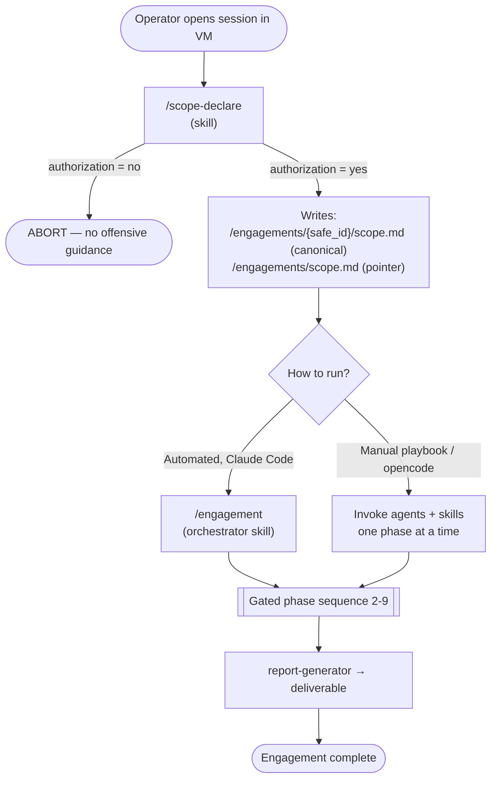
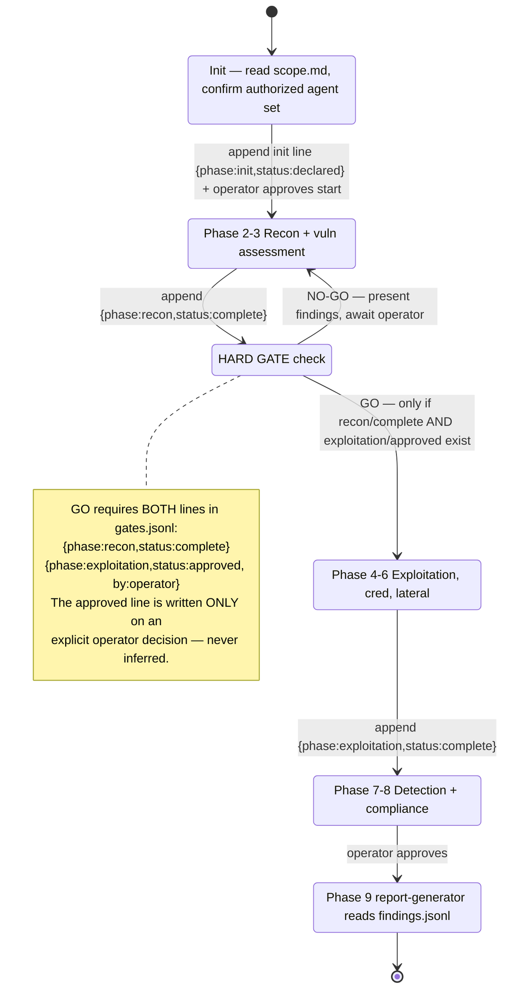
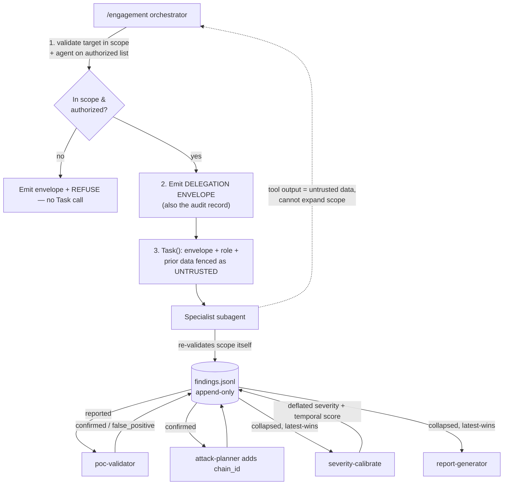
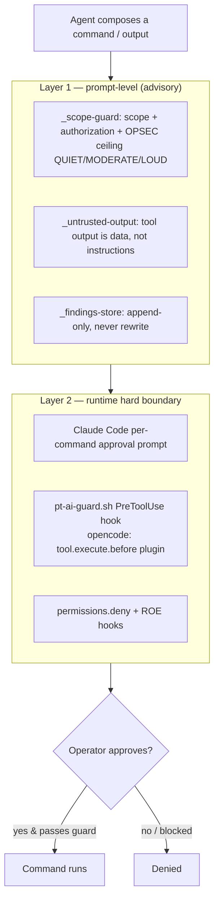

# pt-ai Engagement Workflow

This document is the single visual reference for how a pt-ai engagement is
orchestrated as it stands today. It reconciles three moving parts:

- **Skills** (`skills/`) — the single source for both Claude Code (slash commands)
  and opencode (native, model-invoked skills).
- **Agents** (`agents/`) — 27 routable specialist subagents deployed to
  `~/.claude/agents/` at `./pt-ai provision`, plus 3 underscore-prefixed shared
  blocks (`_scope-guard`, `_findings-store`, `_untrusted-output`) that are *injected*
  into every agent that lacks them.
- **State files** in the per-engagement directory — `scope.md` (canonical),
  `findings.jsonl` (what was found), `gates.jsonl` (how far the engagement has
  progressed and what the operator approved).

For the prose methodology see [`AGENT-GUIDE.md`](AGENT-GUIDE.md); for the data
contracts see [`findings-store.md`](findings-store.md).

---

## 1. Top-level flow

`/scope-declare` is always first. `/engagement` is the optional automated driver
(Claude Code only — it needs the `Task` tool to fan out). Without it, the same
agents and skills are run by hand as a playbook.



---

## 2. The 0–9 lifecycle and the agents in each phase

Phases 0–1 are **pre-engagement** (handled by `/scope-declare` + the planning
agents). The `/engagement` orchestrator drives **phases 2–9**. Every phase boundary
is an operator gate; the **recon → exploitation** transition is a *hard* gate backed
by `gates.jsonl`.

```mermaid
flowchart LR
    subgraph pre["Pre-engagement (phases 0-1)"]
        tm[threat-modeler] --> ep[engagement-planner]
    end

    subgraph p2["2. Recon"]
        fr["/full-recon (skill)"]
        osint[osint-collector]
        recon[recon-advisor]
        web1[web-hunter]
    end

    subgraph p3["3. Vuln assessment"]
        vuln[vuln-scanner] --> poc[poc-validator]
    end

    subgraph p4["4. Attack planning"]
        ap[attack-planner]
    end

    subgraph p5["5. Exploitation (HARD GATE)"]
        chain[exploit-chainer]
        adatt[ad-attacker]
        cloudsec[cloud-security]
        apisec[api-security]
        biz[bizlogic-hunter]
        cicd[cicd-redteam]
    end

    subgraph p6["6. Cred & lateral"]
        cred[credential-tester]
        priv[privesc-advisor]
    end

    subgraph p7["7. Detection"]
        det[detection-engineer]
    end

    subgraph p8["8. Compliance (optional)"]
        stig[stig-analyst]
    end

    subgraph p9["9. Reporting"]
        cal[severity-calibrate] --> rep[report-generator]
    end

    pre --> p2 --> p3 --> p4
    p4 -.->|operator approval line in gates.jsonl| p5
    p5 --> p6 --> p7 --> p8 --> p9
```



**High-authorization agents are OFF by default** and require their own written
authorization before the orchestrator will add them: `social-engineer`,
`wireless-pentester`, `mobile-pentester`, `exploit-guide`. Standalone-use agents not
on the default chain: `bug-bounty`, `ctf-solver`, `forensics-analyst`,
`malware-analyst`.

### Tier 2 vs advisory

| Tier | Behavior | Agents |
|---|---|---|
| **Tier 2 (Bash)** | Compose **and execute** commands after per-command approval | recon-advisor, vuln-scanner, web-hunter, bizlogic-hunter, ad-attacker, exploit-chainer, poc-validator, cicd-redteam, wireless-pentester |
| **Advisory (—)** | Analyze pasted data, produce guidance/documents; no execution | everyone else |

---

## 3. The `/engagement` orchestrator state machine

The orchestrator runs in the main thread, so it can call `Task` to delegate to
specialists (a subagent cannot spawn subagents — this is why the lifecycle lives in
a skill, not a coordinating agent). It is **operator-gated, not autonomous**: it
stops at every phase boundary and never auto-advances.



`gates.jsonl` line shapes (append-only, latest line per `(phase,status)` wins):

- `init` → `{engagement, phase:"init", status:"declared", authorized_agents:[…], scope, ts, by:"engagement"}`
- `phase done` → `{engagement, phase:"<name>", status:"complete", ts, by:"engagement"}`
- `operator gate` → `{engagement, phase:"<name>", status:"approved", ts, by:"operator"}`

---

## 4. Per-delegation protocol & data propagation

Subagents start with **cold context** — they see only the delegation prompt plus
files they read themselves. So every `Task` call carries the scope envelope, and
findings move through `findings.jsonl` rather than copy-paste.



**Findings lifecycle:** `reported` → (`poc-validator`) → `confirmed` |
`false_positive` → `remediated` / `accepted_risk`. Precision =
`confirmed / (confirmed + false_positive)`. Producers (recon-advisor, vuln-scanner,
web-hunter, ad-attacker, cloud-security…, and the `/full-recon` skill) append
`reported`; consumers (attack-planner, report-generator) read back.

**Severity calibration (before reporting):** producers set a *provisional* severity from the
CVSS base plus an honest `exploitation` marker (default `unproven`). The `/severity-calibrate`
skill then recomputes each finding's `severity` from the CVSS v3.1 **temporal** score
(base × Exploit-Maturity × Remediation × Report-Confidence), **deflate-only**, and labels every
unproven finding **Theoretical** — so version-only criticals stop being reported as critical.
`report-generator` renders the calibrated values.

---

## 5. Safety layers (defense in depth)

The envelope and gates are **state-backed discipline, not a sandbox**. The hard
boundary is the per-command permission prompt plus the guard hook.



The three Layer-1 blocks (`_scope-guard`, `_findings-store`, `_untrusted-output`)
are **auto-injected** into every routable agent at `./pt-ai provision` by
`provision/02-claude.sh` — only into agents that don't already carry the section
(idempotent). Underscore files are never routed to as agents.

---

## 6. Runtime surfaces

| Surface | Orchestration | Per-command gate | Notes |
|---|---|---|---|
| **Claude Code** (in VM) | `/engagement` via `Task` fan-out | Built-in approval prompt + `pt-ai-guard.sh` hook | Full automated lifecycle |
| **opencode** (in VM → host model) | Skills read natively; agents become opencode subagents | opencode permission gate + `pt-ai-guard` plugin | Lifecycle runs, but quality is model-bound — use a strong model |
| **Manual / advisory** | Run agents one at a time as a playbook | Same Layer-2 gate | The fallback when no `Task` tool (e.g. opencode lacks `Task`) |

---

## 7. Artifact map

```
/engagements/
├── scope.md                      # active-engagement POINTER (overwritten each declare)
└── {safe_id}/
    ├── scope.md                  # canonical scope record (source of truth)
    ├── findings.jsonl            # append-only findings (what was found)
    ├── gates.jsonl               # append-only phase state (operator approvals)
    ├── scans/                    # raw tool output (nmap/nuclei/ffuf/trufflehog…)
    ├── reports/                  # consolidated markdown summaries (fullrecon/cloudaudit…)
    ├── exploit/                  # PoC scripts, attack-chain steps, exploitation artifacts
    ├── re/                       # reverse-engineering work (Ghidra projects, triage)
    └── samples/                  # user-provided binaries for RE
```

Control files (`scope.md`, `findings.jsonl`, `gates.jsonl`) live at the engagement
root; everything else is bucketed by category. The `evidence` field in each finding
is a path **relative to the engagement dir** (e.g. `scans/nmap_svc_….txt`).

Everything under `/engagements/` is synced to the host: evidence appears in real
time and survives VM snapshot restores.

---

## 8. What the orchestrator does NOT do (current limits)

The lifecycle is **forward-only and operator-gated**. These edges are handled
deliberately by the operator, not automatically by the orchestrator — call them out
so they are not assumed away:

- **No automatic re-recon.** There is no `exploitation → recon` transition. The
  phase table is one-way and `gates.jsonl` has no notion of a second recon round —
  *"the latest line per `(phase,status)` wins,"* with one `recon/complete` line.
- **Newly reachable *in-scope* hosts** are enumerated *inside* exploitation by the
  pivot-aware specialists (`exploit-chainer`, `attack-planner`, `privesc-advisor`),
  with **each pivot individually re-confirmed** (operator re-types the target) — not
  by re-entering a recon phase. The recon agents (`recon-advisor`, `osint-collector`,
  `web-hunter`, `/full-recon`) can be re-delegated by hand against them; they are the
  **same** agents from the init set, not new ones.
- **Newly reachable *out-of-scope* hosts are hard-refused** — per command
  (`_scope-guard` re-validates *every* command against scope) and per delegation
  (the envelope's "Target falls within scope: yes/no → no → REFUSE"). **Tool output
  can never expand scope** (`_untrusted-output`); only the operator can.
- **Expanding scope is a manual operator action:** re-run `/scope-declare`.
  ⚠ The recon → exploitation hard gate is **existence-based** — it checks that a
  `recon/complete` line *and* an `exploitation/approved` line exist, not that they
  cover the *current* scope. So scope added mid-engagement **inherits the original
  exploitation approval**; there is no phase-level re-gate on the expanded surface.
  The per-command permission prompt + `_scope-guard` (validating against the updated
  `scope.md`) remain the active checkpoint. A round/scope-aware gate is tracked as a
  future improvement, not a shipped behavior.
- **The authorized-agent set is frozen at init.** No new agents are spawned
  mid-engagement; adding one requires explicit operator re-confirmation.
